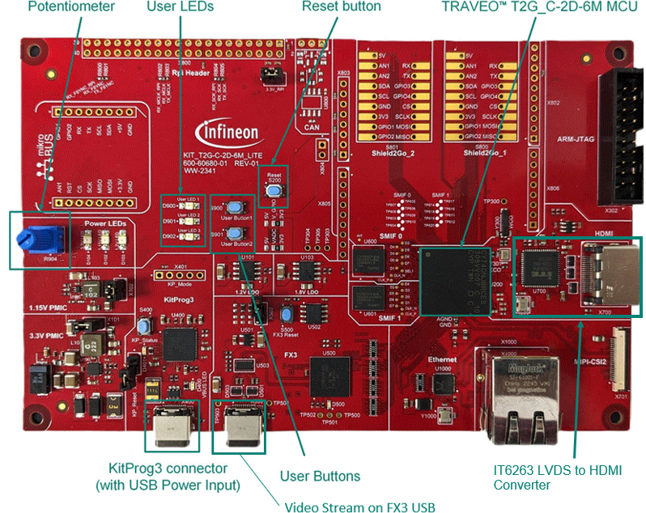
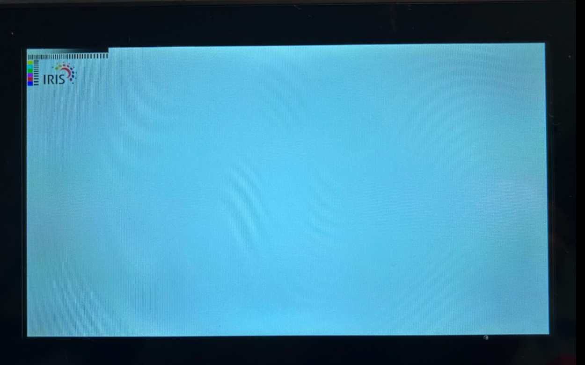
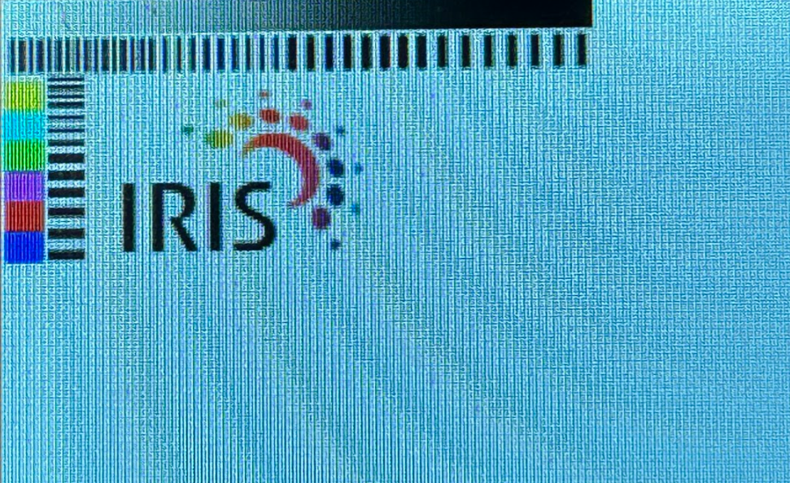

# FPD-link HDMI basic example for graphics middleware

**This code example is for outputting the display of a basic image with graphics library package via FPD-Link of Graphic Subsystems.**  

The drivers used or available in this code example are listed below.
- [Graphics Driver for TRAVEO™ T2G cluster series user guide](https://myicp.infineon.com/sites/TRAVEODocumentation/Lists/defaultdoclib/Forms/AllItems.aspx?RootFolder=%2Fsites%2FTRAVEODocumentation%2FLists%2Fdefaultdoclib%2FTraveo%20II%2FTraveo%20II%20Cluster%2FGraphics&FolderCTID=0x01200023F2B2CA20D58647B6BFDE768454209B&View=%7BC8DBE6BD%2D4E7B%2D49A9%2D9267%2D2F926C13CB27%7D)
  - Chapter 4: Modules
  - Chapter 5: Classes
> **Note:** The above document are available on the myInfineon Collaboration Platform (MyICP). If not already available, please create a myInfineon account on [www.infineon.com](http://www.infineon.com/). Then, contact traveo@infineon.com and request access to TRAVEO™ T2G myICP.

- [JPEG decode driver user guide (TRAVEO™ T2G cluster series)](https://www.infineon.com/assets/row/public/documents/10/44/infineon-traveo-t2g-jpeg-decode-user-guide-usermanual-en.pdf?fileId=8ac78c8c8c3de074018c816028cf0ca8)
  - Chapter 2: JPEG decode driver

## Requirements

- [ModusToolbox&trade;](https://www.infineon.com/modustoolbox) v3.5 or later (tested with v3.5)

## Supported toolchains (make variable 'TOOLCHAIN')

- GNU Arm&reg; Embedded Compiler v11.3.1 (`GCC_ARM`) – Default value of `TOOLCHAIN`

## Device

The device used in this demonstration is:
- [TRAVEO&trade; T2G CYT4DN Series](https://www.infineon.com/cms/en/product/microcontroller/32-bit-traveo-t2g-arm-cortex-microcontroller/32-bit-traveo-t2g-arm-cortex-for-cluster/traveo-t2g-cyt4dn/)

## Board

The board used for testing is:
- TRAVEO&trade; T2G Cluster 6M Lite Kit ([KIT_T2G_C-2D-6M_LITE](https://www.infineon.com/cms/en/product/evaluation-boards/kit_t2g_c-2d-6m_lite/))

## Scope of work
This is a basic code example for converting FPD-Link (LVDS) to HDMI via IT6263 on a TRAVEO&trade;  T2G Cluster 6M Lite Kit and outputting to an HDMI display. See the [Hardware setup](#hardware-setup) for a HDMI display.

## Introduction  

**Graphic Subsystems**
- Supports 2D and 2.5D (perspective warping, 3D effects) graphics rendering
- 40-bit for internal processing (RGBA 10-bit per color channel)
- 24-bit for interfaces (RGB 8-bit per color channel)
- 4096 KB of embedded video RAM memory (VRAM)
- Up to two video output interfaces supporting two displays from
  - Parallel RGB (max display size: 1600 × 600 at 80 MHz) 
  - FPD-link single (max display size: 1920 × 720 at 110 MHz) 
  - FPD-link dual (max display size: 2880 × 1080 at 220 MHz)
- One Capture engine for video input processing for ITU 656 or parallel RGB/YUV or MIPI CSI-2 input
  - ITU656 (standard camera capture: up to 800 × 480)
  - RGB (max capture size 1600 × 600 at 80 MHz) or 
  - Two-/four-lane MIPI CSI-2 interface (max capture size: 1920 × 720 for two lanes at 110 MHz, 2880 × 1080 for 
four lanes at 220 MHz)
- Display warping on-the-fly for HUD applications
- Direct video feed through from capture to display interface with graphics overlay
- Composition engine for scene composition from display layers
- Display engine for video timing generation and display functions
- Drawing engine for acceleration of vector graphics rendering
- Command sequencer for setup and control of the rendering process
- Supports graphics rendering without frame buffers (on-the-fly to both displays)
- Dual-channel FPD-Link interface for up to Wide-HD resolution video output
- JPEG Decoder
  - Decodes JPEG images of various formats into pixel data with conformance to a subset of standard 
ISO/IEC10918-1
  - Color spaces supporting RGB/YUV/Grayscale
  - Supports YUV sub-sampling 4:4:4/4:2:2/4:1:1/4:2:0
  - Image size between 1×1 to 16384×16384 pixels

More details can be found in:
- TRAVEO&trade; T2G CYT4DN
    - [Technical Reference Manual (TRM)](https://www.infineon.com/products/microcontroller/32-bit-traveo-t2g-arm-cortex/for-cluster/t2g-cyt4dn#documents)
    - [Registers TRM](https://www.infineon.com/products/microcontroller/32-bit-traveo-t2g-arm-cortex/for-cluster/t2g-cyt4dn#documents)
    - [Data Sheet](https://www.infineon.com/products/microcontroller/32-bit-traveo-t2g-arm-cortex/for-cluster/t2g-cyt4dn#documents)

## Hardware setup

This demonstration has been developed for:
- TRAVEO&trade; T2G Cluster 6M Lite Kit ([KIT_T2G_C-2D-6M_LITE](https://www.infineon.com/cms/en/product/evaluation-boards/kit_t2g_c-2d-6m_lite/)) 

**Figure 1. KIT_T2G_C-2D-6M_LITE (Top View)**

 
No changes are required from the board's default settings.

HDMI display (hardware prerequisite)
- This code example displays the sample image of 800 x 480 resolution. Supported displays are following.

    - 5inch Capacitive Touch Screen LCD (H) Slimmed-down Version [WaveShare HDMI 800x480](https://www.waveshare.com/5inch-HDMI-LCD-H-V4.htm)
    - 7inch Capacitive Touch Screen LCD (H) with Case [WaveShare HDMI 1024x600](https://www.waveshare.com/product/7inch-hdmi-lcd-h-with-case.htm)

## Implementation

In this code example uses FPD-Link in the graphics subsystem to convert LVDS to HDMI via the on-board IT6263.

- First, enable graphics power and then initialize the graphics environment.
- Next, initialize the graphics environment.
- Configure graphics-related VideoSubSystem interrupts.
- After LVDS has stabilized, detect the video mode and set the image output settings for HDMI (resolution/ PCLK setting and VideoMode etc).
- Hot plug detection is also performed during the main loop.

## Run and Test

After code compilation, perform the following steps to flashing the device:

1. Connect the board to your PC using the provided USB cable through the KitProg3 USB connector.
2. Connect the board to HDMI Display using the HDMI cable through the HDMI connector.  
3. Program the board using one of the following:
    - Select the demonstration project in the Project Explorer.
    - In the **Quick Panel**, scroll down, and click **[Project Name] Program (KitProg3_MiniProg4)**.
4. After programming, the demonstration starts automatically.
    - Note: It takes some time about 20seconds to display the image, because of initilize setting of IT6263 and the others.

5. It will be displayed the basic image like the following.

**Figure 2. Normal image**

 

**Figure 3. Extended image**

 

## References  

Relevant Application notes are:

- [AN235305](https://www.infineon.com/assets/row/public/documents/10/42/infineon-an235305-getting-started-with-traveo-t2g-family-mcus-in-modustoolbox-applicationnotes-en.pdf) - Getting started with TRAVEO&trade; T2G family MCUs in ModusToolbox&trade;

ModusToolbox&trade;  is available online:
- <https://www.infineon.com/modustoolbox>
- [Graphics Driver for TRAVEO™ T2G cluster series user guide](https://myicp.infineon.com/sites/TRAVEODocumentation/Lists/defaultdoclib/Forms/AllItems.aspx?RootFolder=%2Fsites%2FTRAVEODocumentation%2FLists%2Fdefaultdoclib%2FTraveo%20II%2FTraveo%20II%20Cluster%2FGraphics&FolderCTID=0x01200023F2B2CA20D58647B6BFDE768454209B&View=%7BC8DBE6BD%2D4E7B%2D49A9%2D9267%2D2F926C13CB27%7D)
- [JPEG decode driver user guide (TRAVEO™ T2G cluster series)](https://www.infineon.com/assets/row/public/documents/10/44/infineon-traveo-t2g-jpeg-decode-user-guide-usermanual-en.pdf?fileId=8ac78c8c8c3de074018c816028cf0ca8)

ModusToolbox&trade; Graphics middleware is available online:
- <https://github.com/Infineon/tviic2d-gfx-mw>

Associated TRAVEO&trade; T2G MCUs can be found on:
- <https://www.infineon.com/cms/en/product/microcontroller/32-bit-traveo-t2g-arm-cortex-microcontroller/>

More code examples can be found on the GIT repository:
- [TRAVEO&trade; T2G Code examples](https://github.com/orgs/Infineon/repositories?q=mtb-t2g-&type=all&language=&sort=)

For additional trainings, visit our webpage:

- [TRAVEO&trade; T2G trainings](https://www.infineon.com/training/microcontroller-trainings)

For questions and support, use the TRAVEO&trade; T2G Forum:  
- <https://community.infineon.com/t5/TRAVEO-T2G/bd-p/TraveoII>  
